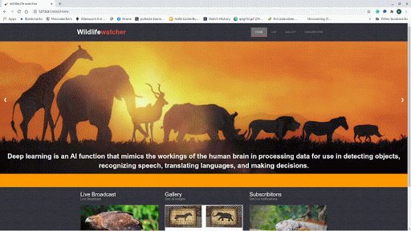
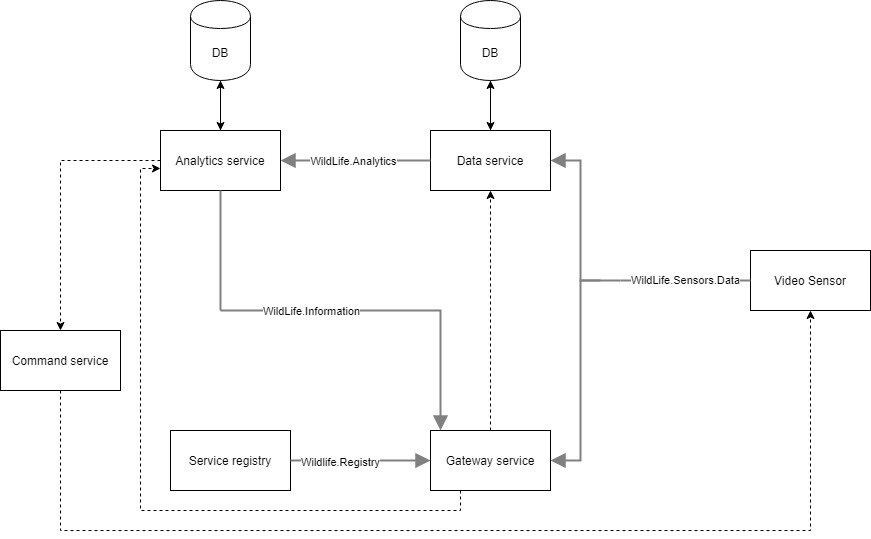
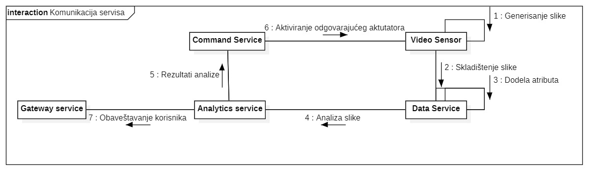
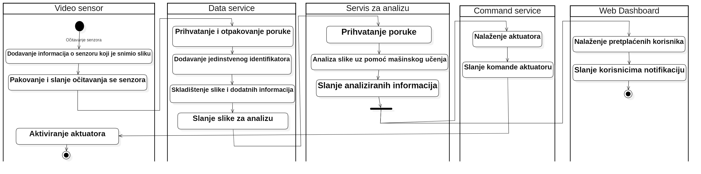

# Wildlife watcher
  
Mikroservis projekat koji uzima sliku sa senzora, cuva je, analizra i salje izvucene informacije korisniku.
Projekat se sastoji iz sledecih mikroservisa:
| Mikroservis | Opis | Putanja |
| ------ | ------ | ------ |
| Analytics servis | Sluzi za izvlacenje informacije iz slike |  [./Analytics/]
| Command servis | Sluzi za slanje komandi aktuatoru |  [./CommandService/]
| Data servis | Sluzi za cuvanje slika kao i infomracije sa kog senzora je slika stigla|  [./DataService/]
| Gateway servis | Pruza web interfejs kao i otvara API ka unutrasnjim servisima spoljnom korisniku |  [./GatewayServis/]
| Registry servis | Sluzi za cuvanje aktivnih servisa |  [./ServiceRegistry/]
| Device servis | Sluzi da simulira citanje podataka sa servisa i izvrsavanje posla aktuatora  |  [./VideoSensors/]


# Opis projekta
Sa pocetne strane mozemo da pristupimo sledećim stranicama:
  - Live - za uživo posmatranje video kamere
  - Gallery - za gledanje već postojećih slika i pretraživanje slika sa kamere ili po životinji
  - Subscribtion - kako bi se podesile notifikacije za određenu životinju.


# Live
  
Ako posetimo stranicu live, sa leve strane imamo opciju da izaberemo kameru koji želimo da posmatramo, kao i informacije o trenutno aktivnoj kameri. Takođe postoji opcija za postavljanje broja frejmova po sekundi koji kamera šalje.

# Gallery
  
Stranica galerija sadrži sve slike koje je senzor poslao. Takođe daje mogućnost pretrage slike preko dva kriterijuma: prema senzorima koje ih je generisao i prema životinjama koje su na slici. Pretraga po senzorima se vrši preko data servisa, koji čuva informaciju koja slika je sa kog servisa generisana, a pretraga po životinjama vrši preko analitičkog servisa, koji čuva sve rezultate analize.

# Subscribtion
  
Na stranici subscribtion korisnik može da izabere koje notifikacije želi da dobije, tj. da izabere za koje životinje želi da ga sistem obavesti. Kada se na senzoru pojavi izabrana životinja korisnik u gornjem desnom uglu dobije notifikaciju kao i mogućnost da klikne na nju kako bi video sliku i detalje o njoj.

# Pokretanje projekta

Za pokretanje projekta potrebno je da se skine [dataset](https://gist.github.com/alexbfree/d0e5ac821e7b57a005c7d9a0cf9edae1) pod nazivom dataset.csv i smesti u folder Device servisa. Takodje potrebno je skinuti [model](https://drive.google.com/file/d/1IqRQVHrxdFajAphioCT6OqtCZ1Ykhtwg/view?usp=sharing) za detekciju da li zivotinaj jede ili ne i smestiti ga u folder za  analytics servis. Nakon toga u glavnom programu potebno je buildovati docker compose i pokrenti ga sledecim kkomandama:
```sh
docker-compose build
docker-compose up
```

# API testiranje
Za testiranje api moguce je importovati postman kolekciju (./Wildlife watcher.postman_collection.json) i tako testirati ili importovati [online](https://web.postman.co/collections/11850883-ce6a572b-2c1a-45e7-bb18-0be52704aea7?version=latest&workspace=7f381795-ce9d-41f0-8cd8-cc0fa0a4d230)


# Struktura projekta

U projektu se koriste sledeci topici:
  - WildLife.Sensors.Data - senzori salju svoje novonatale podatke na ovaj topic
  - Wildlife.Analytics - na ovom topicu se salju podatke (slike) koje potrebno analizirati
  - WildLife.Information - Analytics servis salje nove informacije koje je zakljucio iz primljenih podataka
  - WildLife.Registry - Regestry servis salje informacije kada se pojavi novi servis online ili neki servis ode offline

# Komunikacija
Komunikacija između servisa se odvija na dva načina: sinhrono i asinhrono. Na slici iznad je prikazano kako su servisi međusobno povezani. Isprekidanom linijom prikazana je sinhrona komunikacija dok je debelom sivom linijom prikazana asinhrona komunikacija.

Komunikaciju između servisa možemo da objasnimo na primeru obrade slike. Na slici je prikazan komunikacioni dijagram koji opisuje kako se poruke prenose od kako senzor snimi sliku do trenutka kada obaveštenje stigne do korisnika. Prvi korak je da video senzor servis generiše sliku, nakon toga je šalje asinhronu poruku Data servisu preko komunikacionog kanala koji se zove ,,WildLife.Sensor.Data". Data servis pamti sliku kao i atribute sa kog senzora je došla poruka.

Takođe data servis daje jedinstveni naziv slici. Nakon toga šalje sliku analitičkom servisu preko ,,WildLife.Analytics" komunikacionog kanala. Analitički servis primenjuje tehnike mašinskog učenja kako bi utvrdio šta se nalazi na slici. Rezultate analize prvo šalje sinhrono command servisu kako bi command servis aktivirao odgovarajući aktuator. Command service šalje odgovarajuću komandu odgovarajućem aktuatoru. Takođe analitički servis šalje informacije na
komunikacioni kanal ,,Wildlife.Information" koji osluškuje gateway service kako bi obavestio korisnike kada je uočena njihova omiljena životinja. Detaljnije informacije o ovom procesu moguće je videti na dijagram aktivnosti.  


# Analytics

Servis za analiziranje slika, koristi pipe-filter strukturu koja klasifikuje da li postoji zivotinja na slici ili ne i koja pomocu VGG16 neuornoske mreze YOLO metodom, ako je pronadjena zivotinja prosledjuje se MobileNetV2 klasifikatoru da doda atribut da li se zivotinja hrani ili ne.
[API za Analytics](https://web.postman.co/collections/11850883-ce6a572b-2c1a-45e7-bb18-0be52704aea7?version=latest&workspace=7f381795-ce9d-41f0-8cd8-cc0fa0a4d230#85a8b1c3-fe8f-4edf-9293-ea3d2db46b85):

*GET Image information*, vraca informacije koje su vec izvucene iz neke slike. 
Adresa: */imageSearch*
Parametri:
 - *imageName* - ime slike za koje se traze informacije

Primer poziva:
```sh
curl --location --request GET 'http://127.0.0.1:9020/imageSearch?imageName=5ef5ee4855330940f5437ac8'
```

*GET Find image with specific attributes*, vraca nazive slika koji zadovoljavaju odredjeni kriterjum
Adresa: */informationSearch*
Parametri:
 - *animalName* - opcioni argument koji specifira da vrati slike u kojima se nalazi zivotinja
 - *feeding* - opcioni argument koji specifira da vrati slike u kojima se zivotinja hranili ili ne

Primer poziva:
```sh
curl --location --request GET 'http://127.0.0.1:9020/informationSearch?feeding=false'
```

# Command service
Sluzi za registrovanje komandi aktutatora, i po zahtevu poziva odgovarajucu komandu za odgovarajuci servis.
[API za servis:](https://web.postman.co/collections/11850883-ce6a572b-2c1a-45e7-bb18-0be52704aea7?version=latest&workspace=7f381795-ce9d-41f0-8cd8-cc0fa0a4d230#bfac03e2-a32b-45dd-934e-16c81f0a7ac5)

*GET commands*, vraca sve registrovane komande
Adresa: */*
Nema parametra.

```sh
curl --location --request GET 'http://127.0.0.1:9040'
```

*PUT commands*, pravi novu ili updajtuje vec postojecu komandu
Adresa: */*
Parametri poziva:
    - *commandName* - adresa komande na komand servisu
    - *listOfParametars* - Lista parametara komande odvojenih karakterom ','
    - *typeOfParametars* - Tipovi parametara komande odvojenih karakterom ','
    - *addressOfActuator* - Adresa komande aktutatora
    - *listOfParametarsOfActuator* - Lista naziva parametara karaktera ','

Primer poziva:
```sh
curl --location --request PUT 'http://127.0.0.1:9030?commandName=test&listOfParametars=ime&typeOfParametars=string&addressOfActuator=&listOfParametarsOfActuator=command'
```

*POST poziv komande*  poziva registrovanu komande
Adresa: */{Naziv komande}*
Paramtri poziva:
    - *coordinateN* - sverna kordianta aktuatora
    - *coordinateE* - istocna kordianta aktuatora
    - *listOfParamtears* - lista parametara poziva odvojenih karakterom ','
    

# Data service
Servis koji prima podatke od senzora, snima ih kao i odakle i kada su dosli i salje ih servisu za analizu. 
[API za servis:](https://web.postman.co/collections/11850883-ce6a572b-2c1a-45e7-bb18-0be52704aea7?version=latest&workspace=7f381795-ce9d-41f0-8cd8-cc0fa0a4d230#6914e24a-9ebf-40b5-add1-14e6bdae5d47)

*GET InformationQuery*, vraca informacije sa kog senzora je dosla slike i kada je snimljena
Adresa: */info*
Parametri:
 - *imageName* - Naziv slike za koje se traze informacije
Primer poziva:
```sh
curl --location --request GET 'http://127.0.0.1:9010/info?imageName=5ef693405b3d310788c7e207'
```

*GET Data request*, vraca slike koje su snimljene u odredjenom periodu i/ili sa odredjenog senzora
Adresa: */data*
Parametri:
 - *coordinateN* - Opcioni argument koji specifira slike sa senzora koji imas severnu kordinatu
 - *coordinateE* - Opcioni argument koji specifira slike sa senzora koji imas istocnu kordinatu
 - *startTime* - Opcioni argument koji specifira sve slike koje su snimljene nakon zadatog vremena, (format komande %Y-%m-%dT%H:%M)
 - *endTime* - Opcioni argument koji specifira sve slike koje su snimljene pre zadatog vremena, (format komande %Y-%m-%dT%H:%M)

Primer poziva:
```sh
curl --location --request GET 'http://127.0.0.1:9010/data?coordinateN=44&coordinateE=44&startTime=2020-05-27T00:31&endTime=2020-06-27T00:31'
```

*GET Get images*, vraca trazenu sliku
Adresa: */image*
Parametri:
 - *imageName* - Naziv trazene slike

Primer poziva:
```sh
curl --location --request GET 'http://127.0.0.1:9010/image?imageName=5ef693405b3d310788c7e207'
```

# Gateway service
Webdashboard servis, purza graficki interfejs korisniku pomocu web strainca, ka svim unutrasnjim servisima. Napomena pri koriscenju ovog servisa praviti pozive ka adresi 127.0.0.1 a ne ka localhost da se ne bi pojavio security error o cross-scrpiting.
[API za servis:](https://web.postman.co/collections/11850883-ce6a572b-2c1a-45e7-bb18-0be52704aea7?version=latest&workspace=7f381795-ce9d-41f0-8cd8-cc0fa0a4d230#53849af2-3a73-4ef0-aad5-06e17ba06c5a)

*GET Get sensors*, vraca aktivne senzore koje moguce uzivo posmatrati
Adresa: */sensors*
Nema parametra
Primer poziva:
```sh
curl --location --request GET 'http://127.0.0.1:8080/sensors'
```

*GET Get images information*, vraca sve infomracije o slici
Adresa: */galleryData/GetImageDetails*
Parametri:
 - *imageName* - Naziv slike

Primer poziva:
```sh
curl --location --request GET 'http://127.0.0.1:8080/galleryData/GetImageDetails?imageName=5ef693405b3d310788c7e207'
```

*GET Get images *, vraca sve snimljene slike
Adresa: */galleryData/GetImages*
Nema parametara

Primer poziva:
```sh
curl --location --request GET 'http://127.0.0.1:8080/galleryData/GetImages'
```

*GET Get images by sensor information*, vraca sve slike koje zadovoljavaju kriterijume kada su snimljene i sa kog senzora
Adresa: */galleryData/dataSearch*
Parametri:
Parametri:
 - *coordinateN* - Opcioni argument koji specifira slike sa senzora koji imas severnu kordinatu
 - *coordinateE* - Opcioni argument koji specifira slike sa senzora koji imas istocnu kordinatu
 - *startTime* - Opcioni argument koji specifira sve slike koje su snimljene nakon zadatog vremena, (format komande %Y-%m-%dT%H:%M)
 - *endTime* - Opcioni argument koji specifira sve slike koje su snimljene pre zadatog vremena, (format komande %Y-%m-%dT%H:%M)

Primer poziva:
```sh
curl --location --request GET 'http://127.0.0.1:8080/galleryData/dataSearch?coordinateN=44&coordinateE=44&startTime=2020-05-27T00:31&endTime=2020-06-27T00:31'
```

*GET Get images by specific information*, vraca sve slike u kojima se nalaze odredjene informacije
Adresa: */galleryData/dataSearch*
Parametri:
  - *animalName* - opcioni argument koji specifira da vrati slike u kojima se nalazi zivotinja
 - *feeding* - opcioni argument koji specifira da vrati slike u kojima se zivotinja hranili
 - *feeding* - opcioni argument koji specifira da vrati slike u kojima se zivotinja ne hranili

Primer poziva:
```sh
curl --location --request GET 'http://127.0.0.1:8080/galleryData/informationSearch?animalName=zebra&feeding=true&notfeeding=false'
```

# Service registry
Servis za registrovanje druih servisa i vracanja trenutno aktvnih servisa
[API za servis:](https://web.postman.co/collections/11850883-ce6a572b-2c1a-45e7-bb18-0be52704aea7?version=latest&workspace=7f381795-ce9d-41f0-8cd8-cc0fa0a4d230#028e8564-82b4-4b7c-b3be-141e95c81d89)

*GET Get services*, vraca sve registrovane servisa odredjenog tipa
Adresa: */*
Parametri:
  - *serviceName* - tip servisa

Primer poziva:
```sh
curl --location --request GET 'http://127.0.0.1:8761/?serviceName=test'
```

*POST Registry services*, registruje servis
Adresa: */*
Parametri:
  - *serviceName* - tip servisa
  - serviceAddress - adresa servera koji hostuje service
  - servicePort - na komp portu je registrovan servis
  - serverName - naziv servera koji hostuje servis

Primer poziva:
```sh
curl --location --request GET 'http://127.0.0.1:8761/?serviceName=test'
```

# Video service
Servis koji simuliara interfejs ka senzorima i aktuoatirima. Servis cita url slike iz dataseta, skida sliku i salje je data servisu. Takodje loguje komande koje su zaduzene za aktuatorom

*Get information*, vraca status senzora
Adresa: */*
Nema parametra 
Primer poziva:
```sh
curl --location --request GET 'http://127.0.0.1:9000/'
```

*POST Send command*, salje komandu koja treba da se izvrsi na aktuatoru
Adresa: */*
Parametri:
  - *command* - komonda koja treba da se izvrsi

Primer poziva:
```sh
curl --location --request POST 'http://127.0.0.1:9000/?command=This%20is%20a%20test%20command'
```

